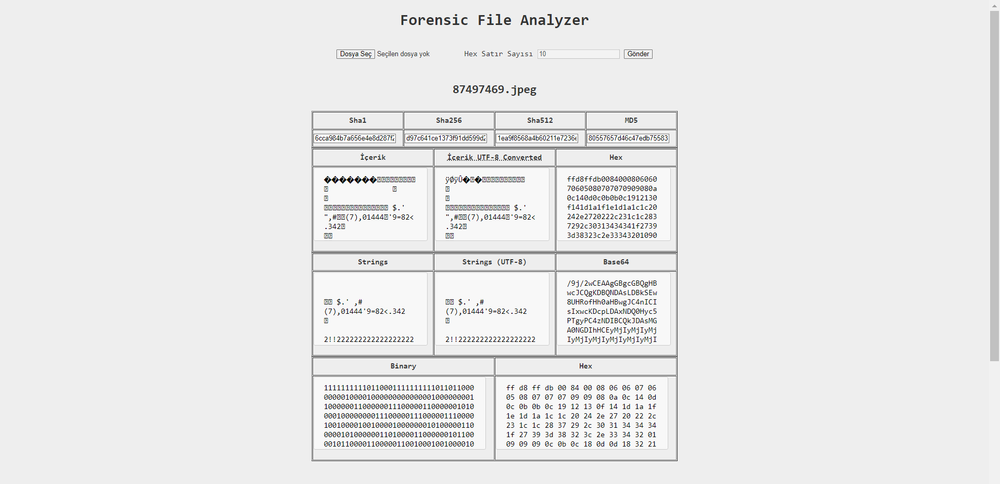
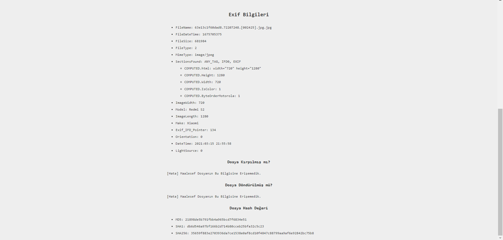

## Secret-Link

<h1 align = 'center'>Ana Tablo</h1>
<p>
 Forensic yazılımı, fikri mülkiyet ihlali veya hırsızlığın meydana gelip gelmediğini belirlemek için yazılım kaynak kodunu veya ikili kodu analiz etme bilimidir.
</p>

<hr />



<p>
 Yukarıda gördüğünüz gibi dosya seçtikten sonra dosyanın üstbilgisini okumak isterseniz limit belirleyip veya max satır kadar uzunluk belirleyip tüm içeriği görebilirsiniz.
</p>

<h1 align = 'center'> Exif </h1>



<p>
EXIF doğrudan bir görüntü biçimi olmayıp; JPEG ve TIFF biçimlerinde kullanılan veri yığını belirtimidir.
EXIF verileri doğrudan dosyanın içerisine kaydedilir ve bu veriler fotoğraf hakkında birçok veri kapsar. Birçok nedenden dolayı bu veriler silinebilir (Örneğin Sosyal medya platformları fotoğrafı elinden geldiğince küçültüp karşıdaki kişiye sadece içeriği atar bu da bazı verilerin kaybolmasına neden olabilir.)
Eğer tüm bilgiler yerindeyse fotoğrafın daha önce kırpıldığını, döndürüldüğünü, oluşturulma tarihini ve benzeri onlarca meta veriye erişebiliriz.
</p>
<br />

<p>
Yüklenilen Fotoğrafları İşlem Bittikten Sonra Silinmeye Ayarladım
Bunu #/system/config.php dosyasından aşağıdaki gibi değiştirip fotoğrafları img/uploads klasöründe kalmasını sağlayabilirsiniz
<p>

```php

//Kullanici Tarafindan Yuklenen Fotograflari Otomatik Sil (true/false)
define('AUTO_DELETE', false);

```

<p>
 İyi Kodlamalar.
</p>
